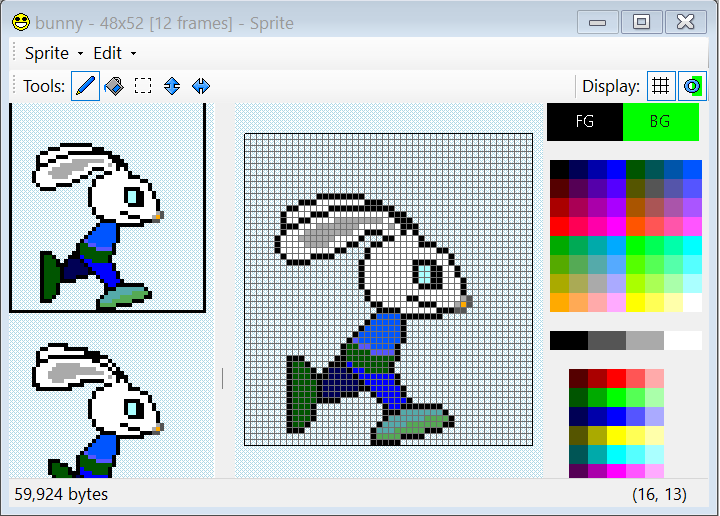
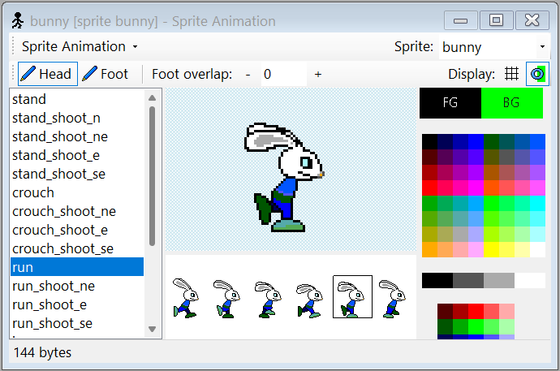
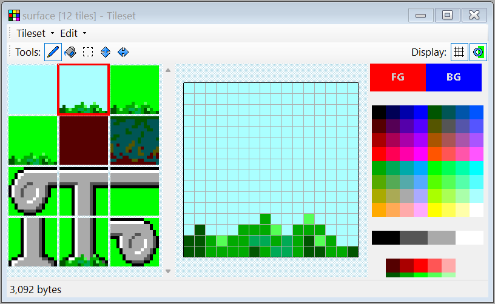
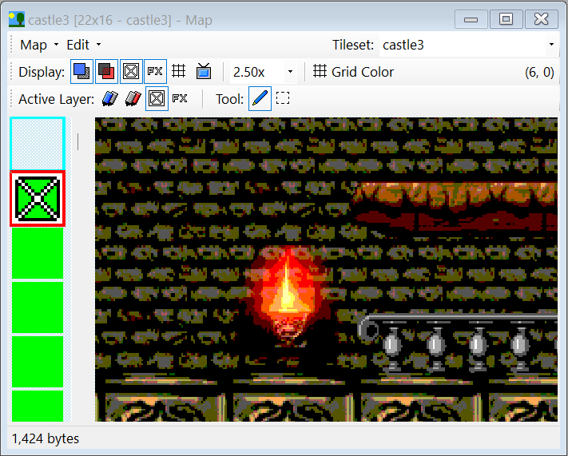
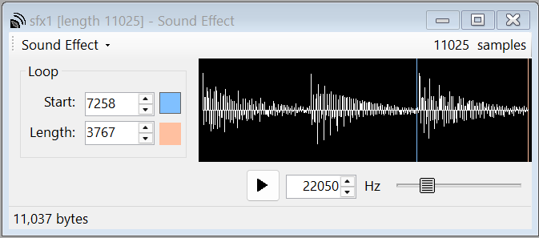
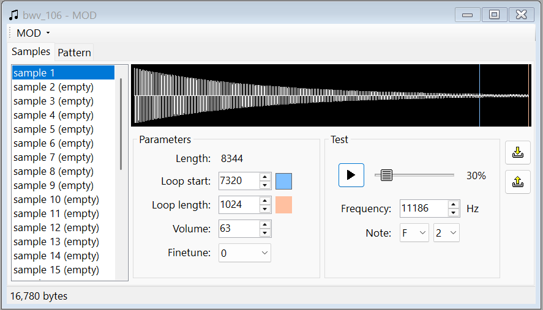
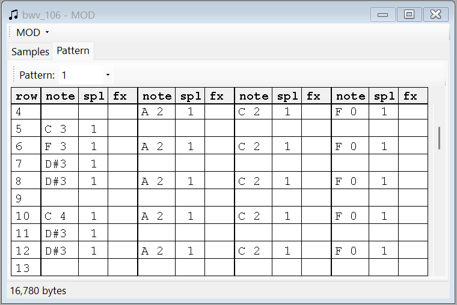
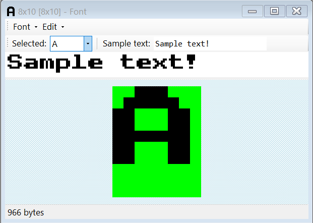
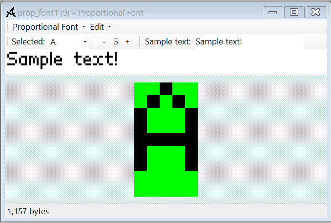

# GameEditor

This is an editor (running on Windows) for the data used in a videogame I'm
writing for the Raspberry Pi Pico 2.

The editor compiles different types of assets (sprites, animations, tilesets,
maps, sound effects, music and fonts) directly into a single C header file
for easy inclusion in the game.

## Asset Types

Each asset type has its own editor that can edit and import/export external files:

### Sprites

Sprites are lists of images of the same size, so a single sprite can contain
(for example) all of the frames of a character's animation.  The images have
64 colors (6 bits per pixel) with a fixed palette since that's how the game
engine works.

The sprite editor has basic functionality to create and edit sprites, including
copying and pasting images so it's easy to use external editors for more advanced
editing.

### Animations

Animations organize images from a sprite into loops of frames to be animated by
the game (for example, a character running animation).

### Tilesets

Tilesets are lists of 16x16-pixel images that are used as tiles of a map. This
editor has similar functionality of the sprite editor (except tiles always have 16x16
pixels).

### Maps

Maps are fragments of the game world. Each map is a grid of background and foreground
tiles from a single tileset. The editor can be used to create and edit maps.

### Sound Effects

Sound effects are stored as mono 22050Hz waveforms.  No editing is supported other
than selecting the start and end loop points, but sounds can be imported and exported
to `.wav` files.

### MOD files (music)

Music is supported in the form of [MOD files](https://en.wikipedia.org/wiki/Module_file).
No editing is supported but files can be imported and exported to `.mod` files.

### Fonts

Fonts are fixed-size images containing 96 characters (the full ASCII table except
the first 32 control characters). The images are stored with 1 bit per pixel.

### Proportional Fonts

Proportional fonts work like fonts, but each character can have a different width
(the height is still fixed for all characters of the font).

